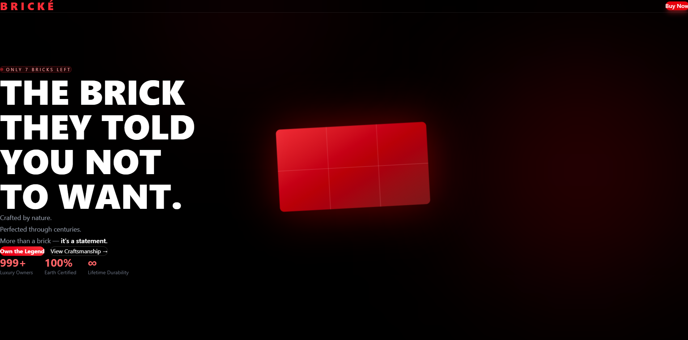
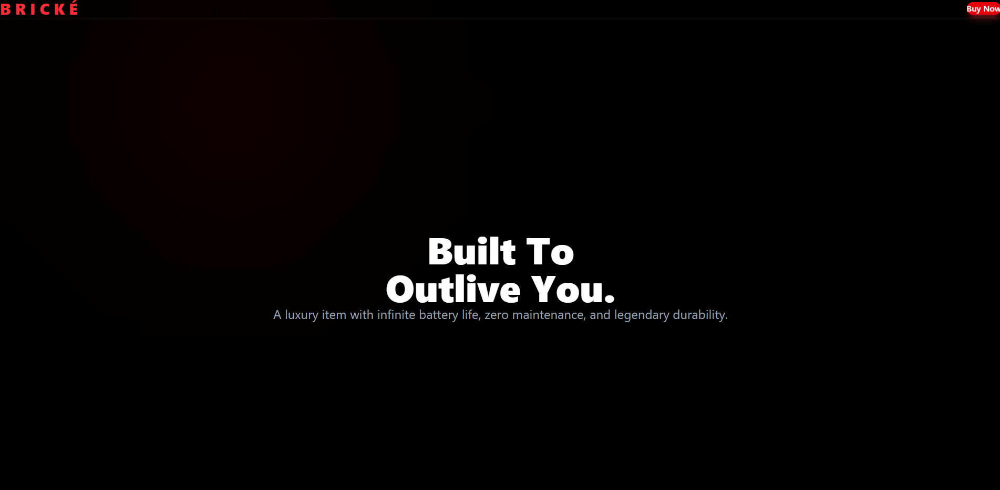
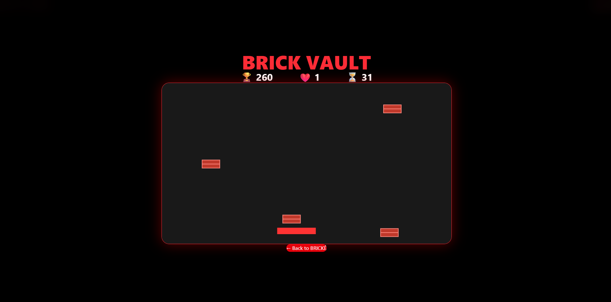

# 🧱 BRICKÉ – The Luxury Brick Experience


> **A modern luxury product landing page with an interactive mini-game built using React, Vite, Tailwind CSS, and Framer Motion.**

---

# 📖 About

**BRICKÉ** is a fictional premium luxury brand website created as a creative front-end project.

The website combines elegant UI design, smooth animations, interactive effects, and a browser-based mini game to create an engaging user experience.

This project demonstrates modern frontend development techniques including:

* Responsive design
* Interactive animations
* Custom Canvas game
* React component architecture
* Tailwind CSS styling
* Framer Motion animations

---

# ✨ Features

## 🎨 Landing Page

* Modern luxury-themed UI
* Animated Hero Section
* Floating particle background
* Mouse spotlight effect
* Smooth scroll animations
* Responsive layout
* Glassmorphism navigation bar
* Animated CTA buttons

---

## 📜 Story Section

* Scroll reveal animations
* Marketing storytelling
* Statistics cards
* Product highlights
* Animated transitions

---

## 🎮 BRICK VAULT Mini Game

A simple browser game where players catch falling bricks.

### Gameplay

* Move the basket using your mouse.
* Catch falling bricks.
* Avoid missing bricks.
* Score points for every successful catch.
* Lose lives when bricks fall.
* Timer countdown.
* Game Over screen.
* Restart Game option.
* Close Game option.

---

# 🛠 Technologies Used

* React
* Vite
* Tailwind CSS
* Framer Motion
* HTML5 Canvas
* JavaScript (ES6+)

---

# 📁 Project Structure

```text
src/
│
├── components/
│   ├── Background.jsx
│   ├── Navbar.jsx
│   ├── Hero.jsx
│   ├── Story.jsx
│   ├── Spotlight.jsx
│   └── BrickGame.jsx
│
├── App.jsx
├── main.jsx
└── index.css
```

---

# 🚀 Installation

Clone the repository

```bash
git clone https://github.com/adhamzarif/bricke.git
```

Go into the project

```bash
cd bricke
```

Install dependencies

```bash
npm install
```

Run development server

```bash
npm run dev
```

Open

```
http://localhost:5173
```

---

# 🎯 Future Improvements

* Sound effects
* Difficulty levels
* Leaderboard
* Mobile touch controls
* Brick power-ups
* Bomb bricks
* Multiple game modes
* Local score saving
* High-score system
* Better particle effects

---

# 📸 Screenshots

## 🏠 Hero Section

The main landing page featuring the luxury branding, animated hero content, and the floating BRICKÉ showcase.



---

## 📖 Story Section

The storytelling section highlighting BRICKÉ's timeless durability and premium craftsmanship.



---

## 🎮 BRICK VAULT Game

The interactive mini-game where players catch falling bricks to earn points before time runs out.



---

# 📄 License

This project is licensed under the **MIT License**.

Feel free to use, modify, and distribute this project while giving appropriate credit.

See the **LICENSE** file for more information.

---

# 👨‍💻 Author

## Adham Zarif

Frontend Developer & Computer Science Student

GitHub:
https://github.com/adhamzarif

---

# ⭐ Support

If you like this project, consider giving it a ⭐ on GitHub.

It helps others discover the project and motivates future development.

---

# ❤️ Acknowledgements

* React Team
* Vite
* Tailwind CSS
* Framer Motion
* Open Source Community

---

## BRICKÉ

> **"More than a brick. It's a statement."**
